# Tách ERD vật lý theo mô đun - LazPe

Tài liệu này dùng để copy script Mermaid vào draw.io hoặc Mermaid Live Editor. Mỗi phần gồm script ERD và mô tả chi tiết theo: mục đích, chức năng, quan hệ và ý nghĩa nghiệp vụ.

> Ghi chú: Các sơ đồ được tách từ ERD vật lý full. Một số bảng trung tâm như `AspNetUsers`, `Products`, `Variants`, `Vouchers`, `Invoices` có thể xuất hiện ở nhiều mô đun để sơ đồ nhỏ vẫn đọc được độc lập.

## ERD-01. Tài khoản, xác thực và phân quyền

### Script Mermaid

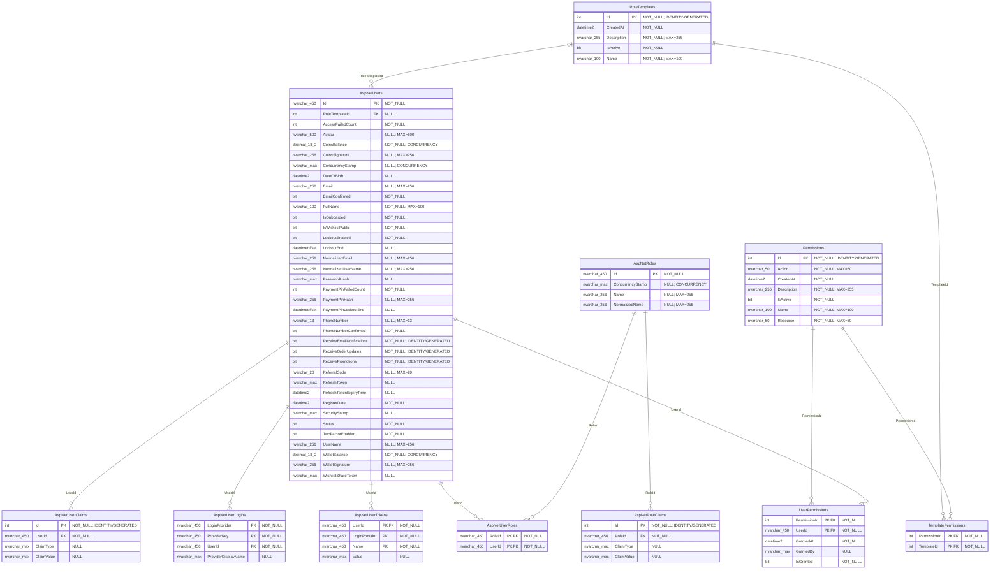

### Mục đích

Sơ đồ này mô tả phần lõi dùng để nhận diện người dùng, xác thực phiên đăng nhập và kiểm soát quyền truy cập trong toàn bộ hệ thống LazPe. Đây là nền tảng bảo mật đầu tiên, vì mọi chức năng như mua hàng, quản lý đơn, quản trị sản phẩm hay xem báo cáo đều cần biết người thao tác là ai và có được phép thực hiện hành động đó hay không.

### Chức năng của mô đun

- Quản lý tài khoản khách hàng và quản trị viên thông qua bảng AspNetUsers.
- Hỗ trợ đăng nhập thường, đăng nhập Google, lưu token, claim và thông tin xác thực mở rộng.
- Phân quyền theo vai trò cơ bản bằng AspNetRoles và AspNetUserRoles.
- Phân quyền chi tiết theo từng chức năng bằng Permissions, UserPermissions, RoleTemplates và TemplatePermissions.
- Làm cơ sở để backend kiểm tra quyền trước khi cho phép truy cập các API quản trị hoặc thao tác nhạy cảm.

### Quan hệ dữ liệu trong sơ đồ

- AspNetUsers liên kết AspNetUserRoles để xác định tài khoản thuộc vai trò nào.
- AspNetRoles liên kết AspNetUserRoles và AspNetRoleClaims để mô tả vai trò và claim của vai trò.
- AspNetUsers liên kết AspNetUserClaims, AspNetUserLogins và AspNetUserTokens để lưu claim riêng, đăng nhập ngoài và token xác thực.
- AspNetUsers liên kết UserPermissions để gán quyền trực tiếp cho từng tài khoản.
- RoleTemplates liên kết TemplatePermissions để tạo bộ quyền mẫu, sau đó người dùng có thể được gán RoleTemplateId.

### Giải thích nghiệp vụ

Khi người dùng đăng nhập, hệ thống kiểm tra thông tin trong AspNetUsers và sinh token. Nếu người dùng là admin hoặc nhân viên, hệ thống tiếp tục kiểm tra vai trò, role template và quyền chi tiết. Nhờ đó, cùng là tài khoản quản trị nhưng mỗi người có thể được phép truy cập những nhóm chức năng khác nhau như sản phẩm, đơn hàng, voucher hoặc báo cáo.

## ERD-02. Hồ sơ người dùng và địa chỉ giao hàng

### Script Mermaid

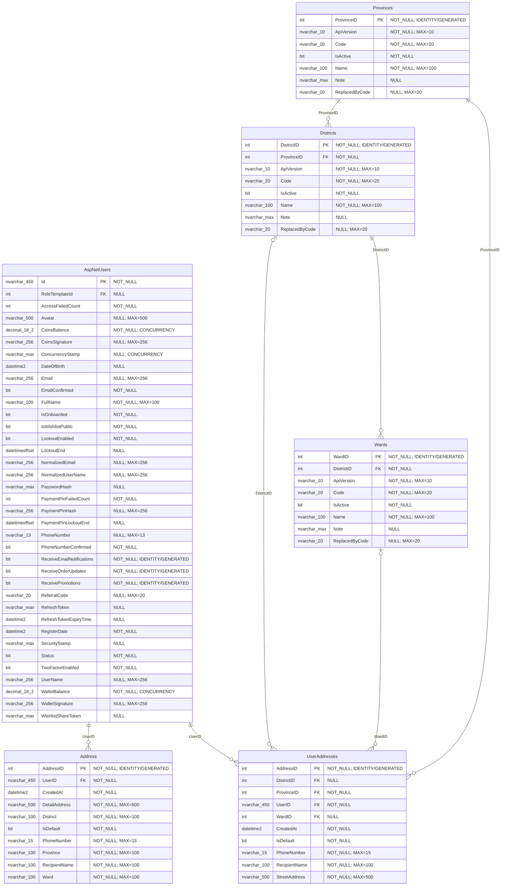

### Mục đích

Sơ đồ này mô tả dữ liệu hồ sơ và địa chỉ giao hàng của người dùng. Mục đích chính là lưu thông tin nhận hàng chính xác, chuẩn hóa địa chỉ theo đơn vị hành chính và cung cấp dữ liệu cho bước checkout, giao hàng, tra cứu đơn và chăm sóc khách hàng.

### Chức năng của mô đun

- Cho phép người dùng thêm, sửa, xóa và đặt địa chỉ giao hàng mặc định.
- Lưu thông tin người nhận, số điện thoại, địa chỉ chi tiết và khu vực hành chính.
- Chuẩn hóa tỉnh/thành phố, quận/huyện, phường/xã để hạn chế nhập sai địa chỉ.
- Cung cấp địa chỉ mặc định cho quy trình tạo đơn hàng từ giỏ hàng.
- Hỗ trợ admin hoặc hệ thống truy xuất thông tin giao nhận khi xử lý đơn.

### Quan hệ dữ liệu trong sơ đồ

- AspNetUsers liên kết UserAddresses theo UserID, thể hiện một người dùng có thể có nhiều địa chỉ.
- UserAddresses liên kết Provinces, Districts và Wards để xác định địa chỉ chuẩn hóa.
- Provinces liên kết Districts, Districts liên kết Wards để tạo cây địa lý ba cấp.
- Address là bảng địa chỉ chung/kiểu cũ, vẫn gắn với người dùng qua UserID.

### Giải thích nghiệp vụ

Trong nghiệp vụ mua hàng, địa chỉ giao hàng là dữ liệu bắt buộc. Người dùng có thể lưu nhiều địa chỉ, nhưng chỉ một địa chỉ được chọn làm mặc định. Khi đặt hàng, hệ thống lấy địa chỉ này hoặc địa chỉ người dùng chọn để ghi vào hóa đơn, giúp đơn hàng vẫn giữ đúng thông tin giao nhận tại thời điểm mua.

## ERD-03. Danh mục, thương hiệu, sản phẩm, thuộc tính và biến thể

### Script Mermaid

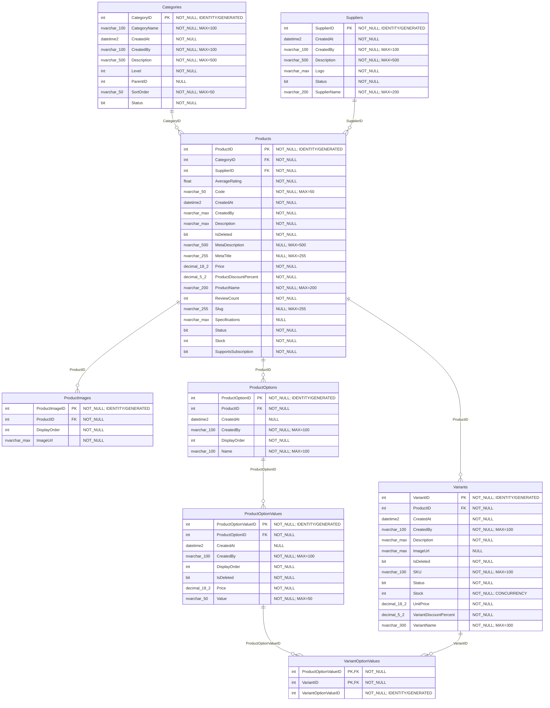

### Mục đích

Sơ đồ này mô tả cấu trúc dữ liệu sản phẩm của LazPe. Đây là nhóm ERD quan trọng nhất trong hệ thống bán lẻ, vì mọi hoạt động như tìm kiếm, xem chi tiết, thêm vào giỏ, đặt hàng, flash sale, combo và đánh giá đều xoay quanh sản phẩm và biến thể sản phẩm.

### Chức năng của mô đun

- Quản lý danh mục để phân loại sản phẩm theo nhóm hàng.
- Quản lý nhà cung cấp/thương hiệu để theo dõi nguồn hàng và hỗ trợ lọc sản phẩm.
- Lưu thông tin sản phẩm gồm tên, mã, mô tả, SEO, trạng thái, giá trị hiển thị và thống kê.
- Quản lý thư viện hình ảnh sản phẩm, ảnh chính, ảnh phụ và thứ tự hiển thị.
- Khai báo thuộc tính lựa chọn như màu sắc, kích cỡ, độ tuổi, dung tích và các giá trị tương ứng.
- Tạo biến thể bán hàng cụ thể, mỗi biến thể có SKU, giá, tồn kho, ảnh và trạng thái riêng.

### Quan hệ dữ liệu trong sơ đồ

- Categories liên kết Products theo CategoryID, một danh mục có nhiều sản phẩm.
- Suppliers liên kết Products theo SupplierID, một nhà cung cấp có nhiều sản phẩm.
- Products liên kết ProductImages, ProductOptions và Variants theo ProductID.
- ProductOptions liên kết ProductOptionValues để lưu các giá trị thuộc tính.
- Variants liên kết ProductOptionValues thông qua VariantOptionValues, tạo quan hệ nhiều-nhiều giữa biến thể và giá trị thuộc tính.

### Giải thích nghiệp vụ

Một sản phẩm trong LazPe có thể có nhiều biến thể, ví dụ cùng một loại tã nhưng khác size hoặc số miếng. ProductOptions định nghĩa nhóm thuộc tính, ProductOptionValues định nghĩa giá trị cụ thể, còn Variants là phiên bản thật được bán. Cách tách này giúp quản lý tồn kho, SKU, giá bán và hình ảnh chính xác cho từng lựa chọn của khách hàng.

## ERD-04. Tìm kiếm, gợi ý, wishlist và cảnh báo sản phẩm

### Script Mermaid

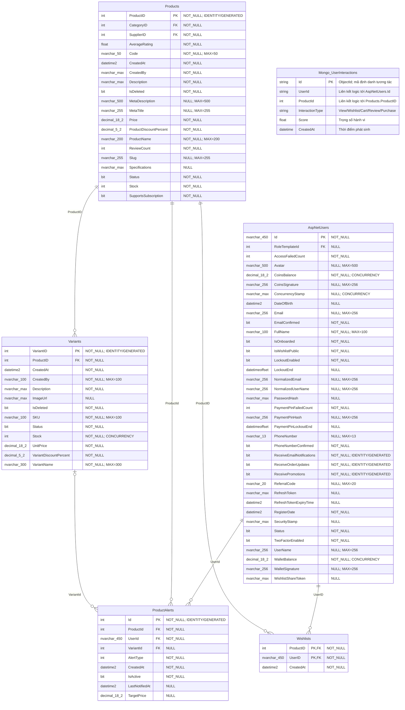

### Mục đích

Sơ đồ này mô tả nhóm dữ liệu giúp khách hàng khám phá sản phẩm và quay lại mua hàng. Nó không chỉ lưu sản phẩm yêu thích mà còn ghi nhận hành vi tương tác để phục vụ gợi ý cá nhân hóa và cảnh báo khi sản phẩm có thay đổi quan trọng.

### Chức năng của mô đun

- Cho phép người dùng lưu sản phẩm vào danh sách yêu thích.
- Cho phép người dùng đăng ký nhận cảnh báo khi sản phẩm còn hàng, giảm giá hoặc có thay đổi.
- Ghi nhận hành vi xem, thêm giỏ, mua hàng, đánh giá hoặc yêu thích để phục vụ recommendation.
- Hỗ trợ cá nhân hóa danh sách sản phẩm gợi ý trên giao diện khách hàng.
- Kết nối dữ liệu sản phẩm và biến thể để cảnh báo đúng mặt hàng người dùng quan tâm.

### Quan hệ dữ liệu trong sơ đồ

- AspNetUsers liên kết Wishlists theo UserID, mỗi người dùng có nhiều sản phẩm yêu thích.
- Products liên kết Wishlists theo ProductID, một sản phẩm có thể được nhiều người yêu thích.
- AspNetUsers liên kết ProductAlerts theo UserId, mỗi người dùng có thể tạo nhiều cảnh báo.
- Products và Variants liên kết ProductAlerts để cảnh báo đúng sản phẩm hoặc đúng biến thể.
- Mongo_UserInteractions liên kết logic với AspNetUsers và Products qua UserId/ProductId, không phải FK vật lý.

### Giải thích nghiệp vụ

Wishlist và ProductAlerts phục vụ nhu cầu trực tiếp của người dùng, còn UserInteractions là dữ liệu nền cho AI/gợi ý. Khi người dùng xem hoặc tương tác với sản phẩm, hệ thống ghi log hành vi. Dữ liệu này giúp hệ thống hiểu người dùng đang quan tâm đến nhóm sản phẩm nào và đưa ra gợi ý phù hợp hơn.

## ERD-05. Giỏ hàng và checkout

### Script Mermaid

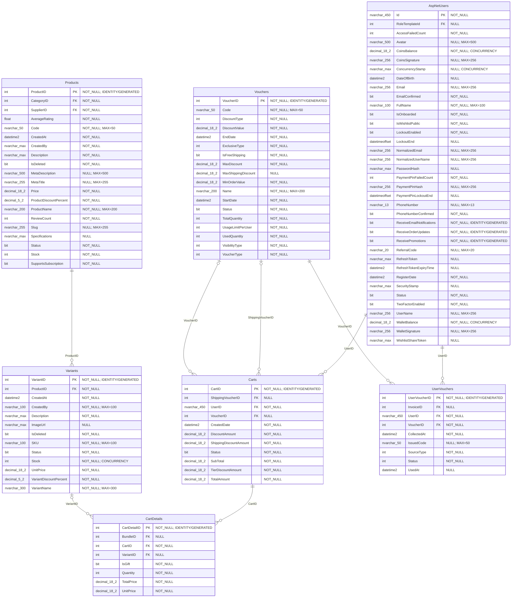

### Mục đích

Sơ đồ này mô tả dữ liệu ở giai đoạn trước khi tạo đơn hàng. Mục đích của mô đun là lưu các sản phẩm khách đã chọn, số lượng, biến thể, quà tặng nếu có và voucher đang áp dụng để chuẩn bị cho bước checkout.

### Chức năng của mô đun

- Tạo và duy trì giỏ hàng riêng cho từng người dùng.
- Lưu từng dòng sản phẩm trong giỏ, gồm biến thể, số lượng, trạng thái chọn mua và thông tin quà tặng.
- Kiểm tra giá, SKU và tồn kho từ Variants trước khi đặt hàng.
- Cho phép áp dụng hoặc gỡ voucher ở giỏ hàng.
- Chuẩn bị dữ liệu đầu vào để tạo hóa đơn từ giỏ hàng.

### Quan hệ dữ liệu trong sơ đồ

- AspNetUsers liên kết Carts theo UserID, mỗi giỏ thuộc về một người dùng.
- Carts liên kết CartDetails, một giỏ có nhiều dòng sản phẩm.
- CartDetails liên kết Variants để xác định biến thể cụ thể được mua.
- Carts có thể liên kết Vouchers qua VoucherID và ShippingVoucherID để lưu voucher đang áp dụng.
- UserVouchers cho biết voucher nào đã được cấp/lưu bởi người dùng và có thể dùng khi checkout.

### Giải thích nghiệp vụ

Giỏ hàng là vùng tạm trước khi đơn hàng chính thức được tạo. Hệ thống không chỉ lưu sản phẩm mà còn phải biết người dùng chọn biến thể nào, số lượng bao nhiêu và voucher nào đang được dùng. Khi người dùng bấm đặt hàng, dữ liệu từ Carts và CartDetails sẽ được chuyển thành Invoices và InvoiceDetails.

## ERD-06. Đơn hàng, hóa đơn, thanh toán và đối soát

### Script Mermaid

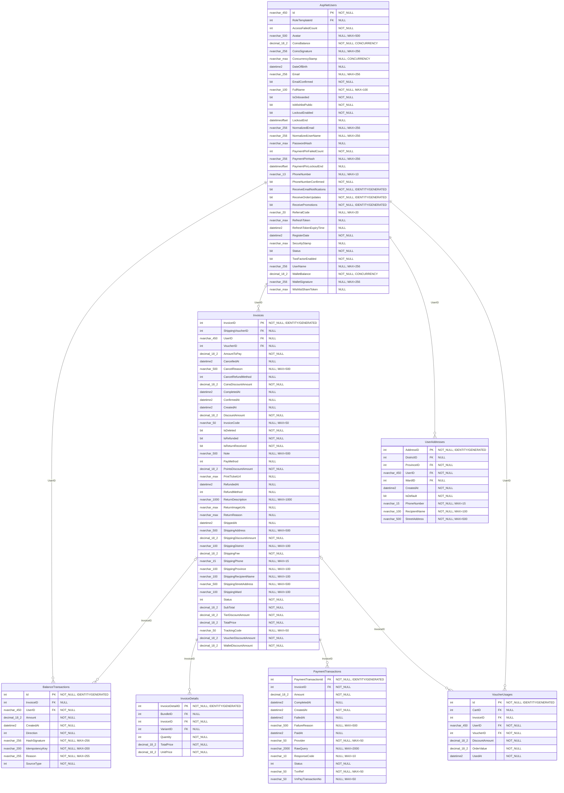

### Mục đích

Sơ đồ này mô tả dữ liệu phát sinh sau khi người dùng đặt hàng. Nó quản lý hóa đơn, chi tiết mặt hàng đã mua, địa chỉ nhận hàng, trạng thái xử lý, thanh toán, voucher đã dùng và biến động ví/xu để đảm bảo đơn hàng được theo dõi đầy đủ từ lúc tạo đến khi hoàn tất.

### Chức năng của mô đun

- Tạo hóa đơn từ giỏ hàng và lưu thông tin giao nhận tại thời điểm đặt.
- Lưu từng sản phẩm/biến thể trong đơn hàng với số lượng, đơn giá và thành tiền.
- Theo dõi trạng thái đơn như chờ xác nhận, đã xác nhận, đang giao, hoàn tất, hủy hoặc hoàn trả.
- Ghi nhận giao dịch thanh toán qua VNPay, ví hoặc phương thức khác.
- Lưu lịch sử sử dụng voucher và biến động số dư để đối soát tài chính.

### Quan hệ dữ liệu trong sơ đồ

- AspNetUsers liên kết Invoices theo UserID, một người dùng có nhiều đơn hàng.
- Invoices liên kết InvoiceDetails, một hóa đơn có nhiều dòng sản phẩm.
- Invoices liên kết PaymentTransactions để ghi nhận các giao dịch thanh toán.
- Invoices liên kết VoucherUsages để biết voucher nào đã dùng cho đơn.
- AspNetUsers liên kết BalanceTransactions để ghi biến động ví/xu, có thể liên quan đến hóa đơn.

### Giải thích nghiệp vụ

Khác với giỏ hàng, hóa đơn là dữ liệu chính thức cần ổn định để đối soát. Vì vậy InvoiceDetails lưu lại giá và thông tin sản phẩm tại thời điểm mua, không phụ thuộc hoàn toàn vào giá hiện tại của sản phẩm. PaymentTransactions và BalanceTransactions giúp kiểm tra tiền đã thanh toán, hoàn tiền, cộng/trừ ví hoặc xu một cách minh bạch.

## ERD-07. Voucher, flash sale, combo và khuyến mãi

### Script Mermaid

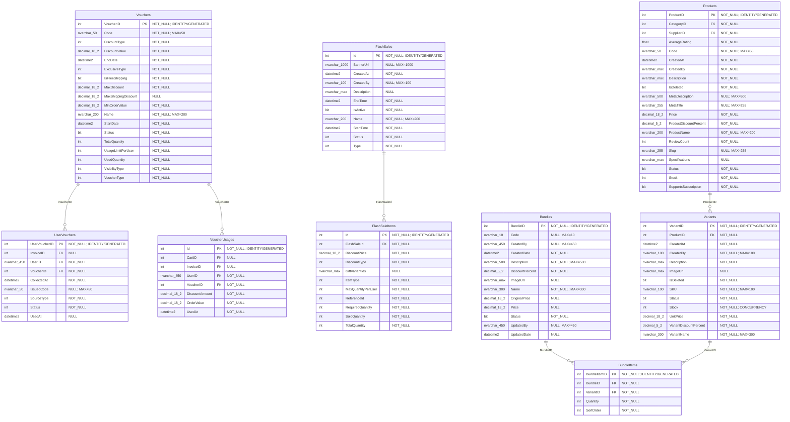

### Mục đích

Sơ đồ này mô tả các chương trình khuyến mãi trong hệ thống. Mục tiêu là quản lý nhiều hình thức ưu đãi như voucher, flash sale và combo để kích cầu mua sắm nhưng vẫn kiểm soát được điều kiện áp dụng, số lượng, thời gian hiệu lực và lịch sử sử dụng.

### Chức năng của mô đun

- Tạo và cấu hình voucher theo mã, loại giảm giá, điều kiện đơn hàng, thời gian và giới hạn sử dụng.
- Cấp voucher cho người dùng hoặc cho phép người dùng tự thu thập voucher.
- Ghi nhận voucher đã được sử dụng để tránh vượt giới hạn.
- Tạo flash sale theo khung giờ và gắn sản phẩm/biến thể tham gia flash sale.
- Tạo combo/bundle gồm nhiều sản phẩm hoặc biến thể với giá ưu đãi.

### Quan hệ dữ liệu trong sơ đồ

- Vouchers liên kết UserVouchers để biết voucher nào thuộc ví voucher của người dùng.
- Vouchers liên kết VoucherUsages để ghi lại lịch sử sử dụng.
- FlashSales liên kết FlashSaleItems, một chương trình có nhiều sản phẩm tham gia.
- FlashSaleItems liên kết Products và Variants để xác định mặt hàng được giảm giá.
- Bundles liên kết BundleItems, mỗi combo gồm nhiều sản phẩm/biến thể thành phần.

### Giải thích nghiệp vụ

Voucher, flash sale và combo là ba kiểu khuyến mãi khác nhau nên cần tách bảng. Voucher áp dụng theo điều kiện đơn hàng hoặc người dùng. Flash sale áp dụng theo thời gian và giới hạn số lượng. Combo gom nhiều sản phẩm thành một gói ưu đãi. Khi checkout, hệ thống phải kiểm tra đầy đủ trạng thái, thời hạn, số lượng và quyền sử dụng trước khi giảm giá.

## ERD-08. Loyalty điểm thưởng, hạng thành viên và chính sách

### Script Mermaid

```mermaid
erDiagram
    AspNetUsers {
        nvarchar_450 Id PK "NOT_NULL"
        int RoleTemplateId FK "NULL"
        int AccessFailedCount "NOT_NULL"
        nvarchar_500 Avatar "NULL; MAX=500"
        decimal_18_2 CoinsBalance "NOT_NULL; CONCURRENCY"
        nvarchar_256 CoinsSignature "NULL; MAX=256"
        nvarchar_max ConcurrencyStamp "NULL; CONCURRENCY"
        datetime2 DateOfBirth "NULL"
        nvarchar_256 Email "NULL; MAX=256"
        bit EmailConfirmed "NOT_NULL"
        nvarchar_100 FullName "NOT_NULL; MAX=100"
        bit IsOnboarded "NOT_NULL"
        bit IsWishlistPublic "NOT_NULL"
        bit LockoutEnabled "NOT_NULL"
        datetimeoffset LockoutEnd "NULL"
        nvarchar_256 NormalizedEmail "NULL; MAX=256"
        nvarchar_256 NormalizedUserName "NULL; MAX=256"
        nvarchar_max PasswordHash "NULL"
        int PaymentPinFailedCount "NOT_NULL"
        nvarchar_256 PaymentPinHash "NULL; MAX=256"
        datetimeoffset PaymentPinLockoutEnd "NULL"
        nvarchar_13 PhoneNumber "NULL; MAX=13"
        bit PhoneNumberConfirmed "NOT_NULL"
        bit ReceiveEmailNotifications "NOT_NULL; IDENTITY/GENERATED"
        bit ReceiveOrderUpdates "NOT_NULL; IDENTITY/GENERATED"
        bit ReceivePromotions "NOT_NULL; IDENTITY/GENERATED"
        nvarchar_20 ReferralCode "NULL; MAX=20"
        nvarchar_max RefreshToken "NULL"
        datetime2 RefreshTokenExpiryTime "NULL"
        datetime2 RegisterDate "NOT_NULL"
        nvarchar_max SecurityStamp "NULL"
        bit Status "NOT_NULL"
        bit TwoFactorEnabled "NOT_NULL"
        nvarchar_256 UserName "NULL; MAX=256"
        decimal_18_2 WalletBalance "NOT_NULL; CONCURRENCY"
        nvarchar_256 WalletSignature "NULL; MAX=256"
        nvarchar_max WishlistShareToken "NULL"
    }
    Invoices {
        int InvoiceID PK "NOT_NULL; IDENTITY/GENERATED"
        int ShippingVoucherID FK "NULL"
        nvarchar_450 UserID FK "NULL"
        int VoucherID FK "NULL"
        decimal_18_2 AmountToPay "NOT_NULL"
        datetime2 CancelledAt "NULL"
        nvarchar_500 CancelReason "NULL; MAX=500"
        int CancelRefundMethod "NULL"
        decimal_18_2 CoinsDiscountAmount "NOT_NULL"
        datetime2 CompletedAt "NULL"
        datetime2 ConfirmedAt "NULL"
        datetime2 CreatedAt "NULL"
        decimal_18_2 DiscountAmount "NOT_NULL"
        nvarchar_50 InvoiceCode "NULL; MAX=50"
        bit IsDeleted "NOT_NULL"
        bit IsRefunded "NOT_NULL"
        bit IsReturnReceived "NOT_NULL"
        nvarchar_500 Note "NULL; MAX=500"
        int PayMethod "NULL"
        decimal_18_2 PointsDiscountAmount "NOT_NULL"
        nvarchar_max PrintTicketUrl "NULL"
        datetime2 RefundedAt "NULL"
        int RefundMethod "NULL"
        nvarchar_1000 ReturnDescription "NULL; MAX=1000"
        nvarchar_max ReturnImageUrls "NULL"
        nvarchar_max ReturnReason "NULL"
        datetime2 ShippedAt "NULL"
        nvarchar_500 ShippingAddress "NULL; MAX=500"
        decimal_18_2 ShippingDiscountAmount "NOT_NULL"
        nvarchar_100 ShippingDistrict "NULL; MAX=100"
        decimal_18_2 ShippingFee "NOT_NULL"
        nvarchar_15 ShippingPhone "NULL; MAX=15"
        nvarchar_100 ShippingProvince "NULL; MAX=100"
        nvarchar_100 ShippingRecipientName "NULL; MAX=100"
        nvarchar_500 ShippingStreetAddress "NULL; MAX=500"
        nvarchar_100 ShippingWard "NULL; MAX=100"
        int Status "NOT_NULL"
        decimal_18_2 SubTotal "NOT_NULL"
        decimal_18_2 TierDiscountAmount "NOT_NULL"
        decimal_18_2 TotalPrice "NOT_NULL"
        nvarchar_50 TrackingCode "NULL; MAX=50"
        decimal_18_2 VoucherDiscountAmount "NOT_NULL"
        decimal_18_2 WalletDiscountAmount "NOT_NULL"
    }
    LoyaltyProfiles {
        nvarchar_450 UserID PK,FK "NOT_NULL"
        int CurrentTierID FK "NOT_NULL"
        int AvailablePoints "NOT_NULL"
        int CurrentCheckInStreak "NOT_NULL"
        datetime2 LastCheckInDate "NULL"
        datetime2 LastUpdated "NOT_NULL"
        int PointsToNextTier "NOT_NULL"
        int RankAdjustmentOffset "NOT_NULL"
        int TotalPoints "NOT_NULL"
    }
    LoyaltyPointHistories {
        bigint HistoryID PK "NOT_NULL; IDENTITY/GENERATED"
        int InvoiceID FK "NULL"
        nvarchar_450 UserID FK "NOT_NULL"
        int Amount "NOT_NULL"
        datetime2 CreatedAt "NOT_NULL"
        nvarchar_500 Description "NOT_NULL; MAX=500"
        nvarchar_20 TransactionType "NOT_NULL; MAX=20"
    }
    LoyaltyTiers {
        int TierID PK "NOT_NULL; IDENTITY/GENERATED"
        nvarchar_200 BadgeIcon "NOT_NULL; MAX=200"
        nvarchar_50 ColorHex "NOT_NULL; MAX=50"
        datetime2 CreatedAt "NOT_NULL"
        bit IsActive "NOT_NULL"
        int MinPoints "NOT_NULL"
        nvarchar_100 TierName "NOT_NULL; MAX=100"
        datetime2 UpdatedAt "NOT_NULL"
    }
    LoyaltyEarnPolicies {
        int PolicyID PK "NOT_NULL; IDENTITY/GENERATED"
        datetime2 CreatedAt "NOT_NULL"
        nvarchar_256 CreatedBy "NOT_NULL; MAX=256"
        datetime2 EndDate "NULL"
        bit IsActive "NOT_NULL"
        bit IsCampaign "NOT_NULL"
        decimal_5_2 Multiplier "NOT_NULL"
        nvarchar_200 Name "NOT_NULL; MAX=200"
        int PointsEarned "NOT_NULL"
        datetime2 StartDate "NULL"
        decimal_18_2 VndAmount "NOT_NULL"
    }
    LoyaltyRedeemPolicies {
        int PolicyID PK "NOT_NULL; IDENTITY/GENERATED"
        int TierID FK "NULL"
        datetime2 CreatedAt "NOT_NULL"
        nvarchar_256 CreatedBy "NOT_NULL; MAX=256"
        decimal_18_2 DiscountVnd "NOT_NULL"
        datetime2 EndDate "NULL"
        bit IsActive "NOT_NULL"
        nvarchar_200 Name "NOT_NULL; MAX=200"
        int PointsToRedeem "NOT_NULL"
        datetime2 StartDate "NULL"
    }
    LoyaltyTierPrivileges {
        int PrivilegeID PK "NOT_NULL; IDENTITY/GENERATED"
        int TierID FK "NOT_NULL"
        datetime2 CreatedAt "NOT_NULL"
        nvarchar_256 CreatedBy "NOT_NULL; MAX=256"
        bit IsActive "NOT_NULL"
        nvarchar_200 Name "NOT_NULL; MAX=200"
        nvarchar_50 PrivilegeType "NOT_NULL; MAX=50"
        nvarchar_500 Value "NULL; MAX=500"
    }
    LoyaltyMonthlyVouchers {
        int VoucherConfigID PK "NOT_NULL; IDENTITY/GENERATED"
        int TierID FK "NOT_NULL"
        datetime2 CreatedAt "NOT_NULL"
        int DiscountType "NOT_NULL"
        decimal_18_2 DiscountValue "NOT_NULL"
        bit IsActive "NOT_NULL"
        decimal_18_2 MaxDiscount "NOT_NULL"
        decimal_18_2 MinOrderValue "NOT_NULL"
        int ValidityDays "NOT_NULL"
        int VoucherCount "NOT_NULL"
    }
    LoyaltyAuditLogs {
        bigint LogID PK "NOT_NULL; IDENTITY/GENERATED"
        nvarchar_50 Action "NOT_NULL; MAX=50"
        nvarchar_256 ActorEmail "NOT_NULL; MAX=256"
        nvarchar_450 ActorID "NOT_NULL; MAX=450"
        nvarchar_100 EntityID "NOT_NULL; MAX=100"
        nvarchar_100 EntityName "NOT_NULL; MAX=100"
        nvarchar_max NewValue "NULL"
        nvarchar_1000 Notes "NULL; MAX=1000"
        nvarchar_max OldValue "NULL"
        datetime2 Timestamp "NOT_NULL"
    }
    LoyaltyManualRevocations {
        int RevocationID PK "NOT_NULL; IDENTITY/GENERATED"
        nvarchar_450 UserID FK "NOT_NULL"
        int Amount "NOT_NULL"
        nvarchar_450 AuditorID "NOT_NULL; MAX=450"
        datetime2 CreatedAt "NOT_NULL"
        nvarchar_500 Reason "NOT_NULL; MAX=500"
    }
    LoyaltyBirthdayGiftLogs {
        int GiftLogID PK "NOT_NULL; IDENTITY/GENERATED"
        nvarchar_450 UserID FK "NOT_NULL; MAX=450"
        nvarchar_50 GiftType "NOT_NULL; MAX=50"
        nvarchar_200 GiftValue "NOT_NULL; MAX=200"
        nvarchar_256 IssuedBy "NOT_NULL; MAX=256"
        datetime2 ReceivedAt "NOT_NULL"
        int Year "NOT_NULL"
    }
    LoyaltySettings {
        int Id PK "NOT_NULL; IDENTITY/GENERATED"
        int AllowEditReviewTimeLimitMinutes "NOT_NULL"
        bit AllowMultipleRewardsPerProduct "NOT_NULL"
        bit EnableReviewReward "NOT_NULL"
        int MaxReviewDaysAfterReceipt "NOT_NULL"
        int MinimumReviewChars "NOT_NULL"
        int MinimumReviewWords "NOT_NULL"
        bit RequireDeliveryToReview "NOT_NULL"
        int RequiredRatingForReward "NOT_NULL"
        int ReviewRewardPoints "NOT_NULL"
        int ReviewWithImageRewardPoints "NOT_NULL"
        int ReviewWithVideoRewardPoints "NOT_NULL"
        datetime2 UpdatedAt "NOT_NULL"
        int WelcomeVoucherID "NULL"
    }
    AspNetUsers o|--o{ Invoices : "UserID"
    AspNetUsers ||--o{ LoyaltyBirthdayGiftLogs : "UserID"
    AspNetUsers ||--o{ LoyaltyManualRevocations : "UserID"
    LoyaltyTiers ||--o{ LoyaltyMonthlyVouchers : "TierID"
    Invoices o|--o{ LoyaltyPointHistories : "InvoiceID"
    LoyaltyProfiles ||--o{ LoyaltyPointHistories : "UserID"
    AspNetUsers ||--o| LoyaltyProfiles : "UserID"
    LoyaltyTiers ||--o{ LoyaltyProfiles : "CurrentTierID"
    LoyaltyTiers o|--o{ LoyaltyRedeemPolicies : "TierID"
    LoyaltyTiers ||--o{ LoyaltyTierPrivileges : "TierID"
```

### Mục đích

Sơ đồ này mô tả chương trình khách hàng thân thiết của LazPe. Mục đích là ghi nhận điểm thưởng, hạng thành viên, lịch sử tích/đổi điểm, đặc quyền theo hạng và các chính sách vận hành để giữ chân khách hàng sau mỗi lần mua hoặc tương tác với hệ thống.

### Chức năng của mô đun

- Tạo hồ sơ loyalty cho từng người dùng và theo dõi điểm hiện có.
- Ghi lịch sử cộng/trừ điểm từ mua hàng, đánh giá, điểm danh hoặc thao tác thủ công.
- Quản lý hạng thành viên và điều kiện lên hạng.
- Cấu hình chính sách tích điểm, đổi điểm, voucher hàng tháng và quà sinh nhật.
- Ghi audit log để kiểm soát thay đổi chính sách hoặc điều chỉnh điểm.

### Quan hệ dữ liệu trong sơ đồ

- AspNetUsers liên kết 1-1 LoyaltyProfiles qua UserID.
- LoyaltyProfiles liên kết LoyaltyTiers để xác định hạng hiện tại.
- LoyaltyPointHistories liên kết người dùng và có thể liên kết Invoices khi điểm phát sinh từ đơn hàng.
- LoyaltyTierPrivileges liên kết LoyaltyTiers để khai báo quyền lợi theo hạng.
- LoyaltyMonthlyVouchers, LoyaltyEarnPolicies, LoyaltyRedeemPolicies và LoyaltySettings là các bảng cấu hình chính sách.

### Giải thích nghiệp vụ

Loyalty không chỉ là một cột điểm trong bảng người dùng. Hệ thống cần biết người dùng đang ở hạng nào, điểm phát sinh từ đâu, chính sách nào đang áp dụng và ai đã thay đổi dữ liệu. Vì vậy mô đun này tách riêng hồ sơ, lịch sử điểm, chính sách, đặc quyền, nhật ký và cấu hình để dễ quản trị và kiểm tra.

## ERD-09. Đổi điểm lấy voucher và giới thiệu người dùng

### Script Mermaid

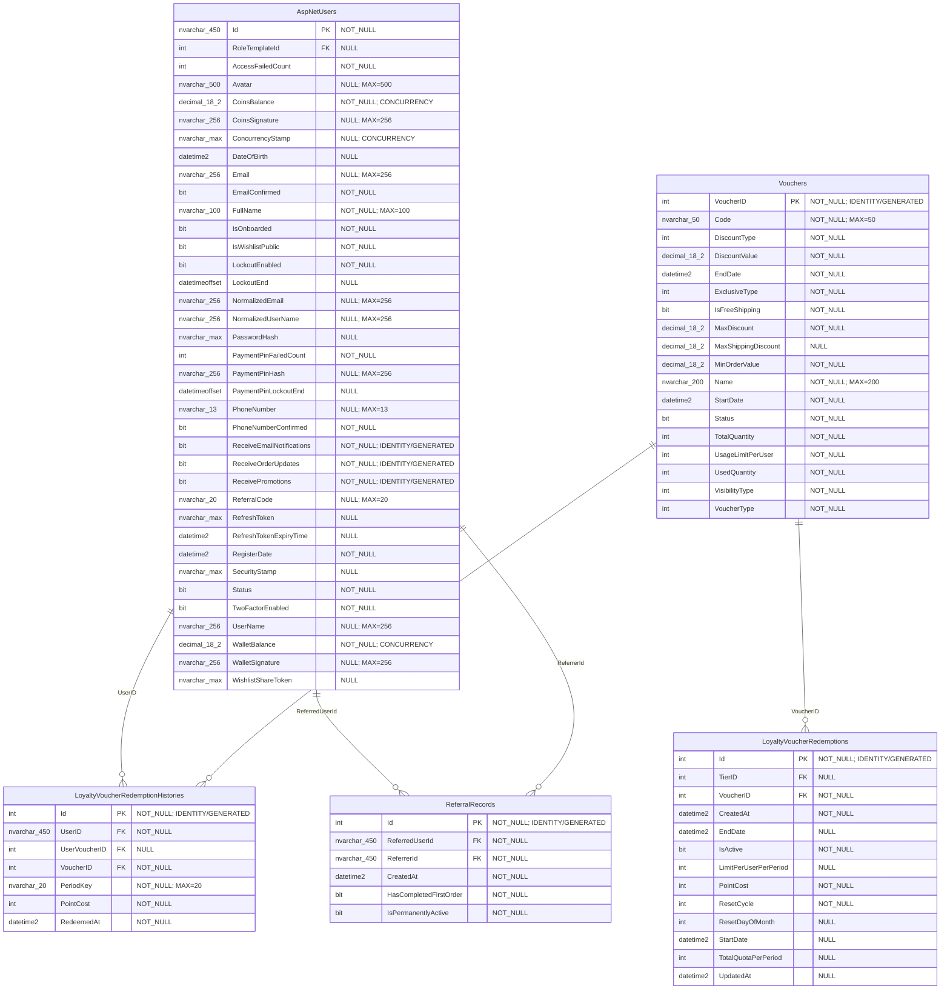

### Mục đích

Sơ đồ này tách phần mở rộng của loyalty gồm đổi điểm lấy voucher và giới thiệu người dùng. Mục đích là biến điểm thưởng thành quyền lợi cụ thể, đồng thời ghi nhận quan hệ referral để khuyến khích người dùng giới thiệu khách hàng mới.

### Chức năng của mô đun

- Quản lý danh sách voucher có thể đổi bằng điểm.
- Kiểm soát số điểm cần đổi, số lượng voucher, thời gian hiệu lực và trạng thái đổi.
- Ghi lại lịch sử người dùng đã đổi voucher nào và vào thời điểm nào.
- Liên kết voucher được đổi với bảng Vouchers để người dùng có thể sử dụng ở checkout.
- Ghi nhận người giới thiệu, người được giới thiệu và trạng thái thưởng referral.

### Quan hệ dữ liệu trong sơ đồ

- LoyaltyVoucherRedemptions liên kết Vouchers để xác định phần thưởng đổi điểm là voucher nào.
- LoyaltyVoucherRedemptionHistories liên kết AspNetUsers để biết người đổi là ai.
- LoyaltyVoucherRedemptionHistories liên kết LoyaltyVoucherRedemptions để biết gói đổi điểm nào được dùng.
- ReferralRecords có hai FK đến AspNetUsers: ReferrerId và ReferredUserId.

### Giải thích nghiệp vụ

Khi người dùng đủ điểm, họ có thể đổi điểm lấy voucher. Mỗi lần đổi cần được ghi lịch sử để trừ điểm, cấp voucher và chống đổi vượt giới hạn. ReferralRecords lại phục vụ chương trình giới thiệu, nơi một tài khoản có thể tạo mã mời và hệ thống ghi nhận tài khoản mới được mời bởi ai.

## ERD-10. Đánh giá sản phẩm, bình luận và kiểm duyệt

### Script Mermaid

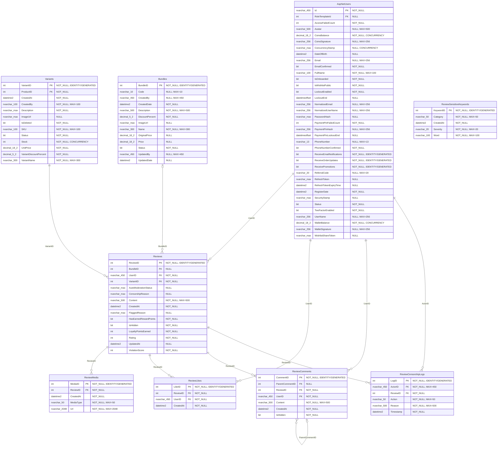

### Mục đích

Sơ đồ này mô tả dữ liệu nội dung do người dùng tạo sau mua hàng. Mục đích là cho phép khách đánh giá sản phẩm, đăng hình/video, bình luận, tương tác với đánh giá và hỗ trợ admin kiểm duyệt nội dung không phù hợp.

### Chức năng của mô đun

- Cho phép người dùng tạo, sửa, xóa đánh giá sản phẩm hoặc combo.
- Lưu media đính kèm như hình ảnh hoặc video minh họa trải nghiệm sử dụng.
- Cho phép người dùng thích đánh giá và bình luận/phản hồi dưới đánh giá.
- Ghi lịch sử kiểm duyệt để biết ai đã duyệt, ẩn, từ chối hoặc xử lý nội dung.
- Quản lý từ khóa nhạy cảm để hỗ trợ kiểm duyệt tự động.

### Quan hệ dữ liệu trong sơ đồ

- AspNetUsers liên kết Reviews, ReviewLikes, ReviewComments và ReviewCensorshipLogs theo người tạo hoặc người xử lý.
- Reviews liên kết Variants để xác định sản phẩm/biến thể được đánh giá.
- Reviews có thể liên kết Bundles nếu đánh giá áp dụng cho combo.
- Reviews liên kết ReviewMedia, ReviewLikes, ReviewComments và ReviewCensorshipLogs.
- ReviewComments có thể tự liên kết ParentCommentID để tạo trả lời lồng nhau.

### Giải thích nghiệp vụ

Đánh giá là dữ liệu quan trọng vì ảnh hưởng trực tiếp đến quyết định mua hàng. Hệ thống cần lưu nội dung đánh giá, media, tương tác và bình luận, đồng thời phải có cơ chế kiểm duyệt để bảo vệ chất lượng nội dung. ReviewSensitiveKeywords hỗ trợ phát hiện từ ngữ vi phạm trước khi nội dung được hiển thị công khai.

## ERD-11. Thông báo, chat hỗ trợ và tin nhắn

### Script Mermaid

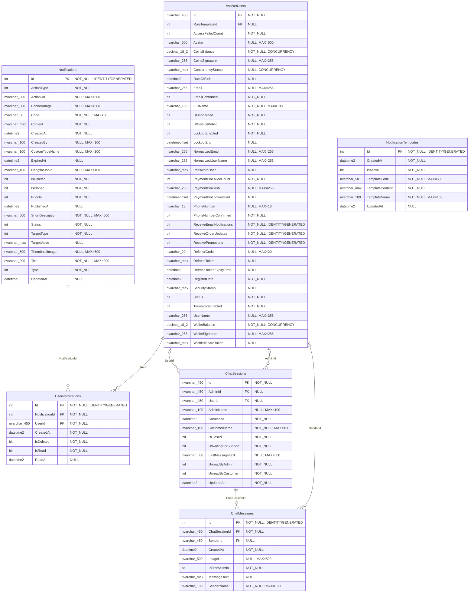

### Mục đích

Sơ đồ này mô tả nhóm dữ liệu giao tiếp giữa hệ thống, khách hàng và nhân viên hỗ trợ. Mục đích là gửi thông báo đúng người, quản lý trạng thái đã đọc và lưu lịch sử trao đổi trong các phiên chat hỗ trợ.

### Chức năng của mô đun

- Tạo thông báo hệ thống hoặc chiến dịch thông báo cho người dùng.
- Phân phối thông báo đến từng người dùng và lưu trạng thái đã đọc/chưa đọc.
- Quản lý mẫu thông báo để tái sử dụng cho đơn hàng, voucher, bảo mật và khuyến mãi.
- Tạo phiên chat hỗ trợ giữa khách hàng và admin/nhân viên.
- Lưu nội dung từng tin nhắn, người gửi, thời điểm gửi và trạng thái phiên.

### Quan hệ dữ liệu trong sơ đồ

- Notifications liên kết UserNotifications, một thông báo có thể gửi cho nhiều người dùng.
- AspNetUsers liên kết UserNotifications để biết thông báo thuộc tài khoản nào.
- ChatSessions liên kết AspNetUsers qua UserId và AdminId để biết khách hàng và nhân viên phụ trách.
- ChatMessages liên kết ChatSessions, một phiên chat có nhiều tin nhắn.
- ChatMessages liên kết AspNetUsers qua SenderId để biết người gửi tin nhắn.

### Giải thích nghiệp vụ

Notification và chat phục vụ hai kiểu giao tiếp khác nhau. Thông báo là dạng một chiều hoặc chiến dịch, cần biết người nhận và trạng thái đọc. Chat là giao tiếp hai chiều theo phiên, cần lưu đầy đủ tin nhắn và người phụ trách để admin tiếp tục hỗ trợ khách hàng khi cần.

## ERD-12. Hồ sơ bé, tăng trưởng và tiêm chủng

### Script Mermaid

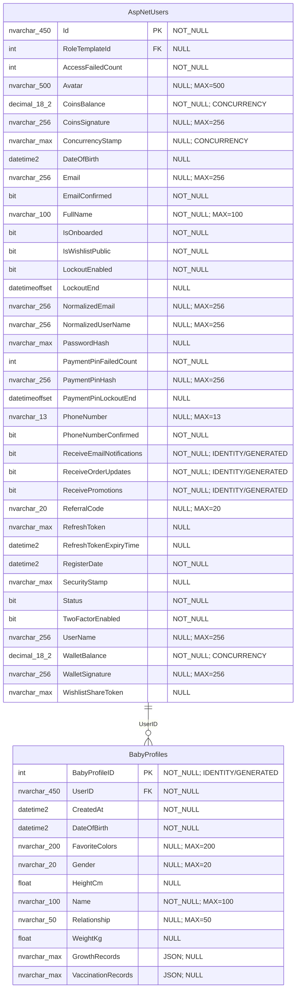

### Mục đích

Sơ đồ này mô tả dữ liệu chăm sóc bé gắn với tài khoản khách hàng. Đây là điểm đặc thù của LazPe, giúp hệ thống không chỉ bán sản phẩm mà còn hỗ trợ phụ huynh theo dõi thông tin phát triển của trẻ.

### Chức năng của mô đun

- Cho phép người dùng tạo nhiều hồ sơ bé trong cùng một tài khoản.
- Lưu thông tin cơ bản của bé như tên, ngày sinh, giới tính, cân nặng, chiều cao và quan hệ với người dùng.
- Lưu lịch sử tăng trưởng bằng GrowthRecords dạng JSON.
- Lưu lịch sử tiêm chủng bằng VaccinationRecords dạng JSON.
- Cung cấp dữ liệu cho timeline chăm sóc bé và gợi ý sản phẩm theo độ tuổi.

### Quan hệ dữ liệu trong sơ đồ

- AspNetUsers liên kết BabyProfiles theo UserID, một tài khoản có thể có nhiều hồ sơ bé.
- GrowthRecords và VaccinationRecords không tách thành bảng riêng mà được lưu dạng JSON trong BabyProfiles.

### Giải thích nghiệp vụ

Vì mỗi bé có nhiều mốc tăng trưởng và tiêm chủng, hệ thống dùng JSON owned type để lưu các danh sách này ngay trong BabyProfiles. Cách này giúp dữ liệu hồ sơ bé gọn hơn, phù hợp với các bản ghi lịch sử nhỏ gắn chặt với một hồ sơ bé cụ thể.

## ERD-13. Mua hàng định kỳ và lịch sử thanh toán định kỳ

### Script Mermaid

```mermaid
erDiagram
    AspNetUsers {
        nvarchar_450 Id PK "NOT_NULL"
        int RoleTemplateId FK "NULL"
        int AccessFailedCount "NOT_NULL"
        nvarchar_500 Avatar "NULL; MAX=500"
        decimal_18_2 CoinsBalance "NOT_NULL; CONCURRENCY"
        nvarchar_256 CoinsSignature "NULL; MAX=256"
        nvarchar_max ConcurrencyStamp "NULL; CONCURRENCY"
        datetime2 DateOfBirth "NULL"
        nvarchar_256 Email "NULL; MAX=256"
        bit EmailConfirmed "NOT_NULL"
        nvarchar_100 FullName "NOT_NULL; MAX=100"
        bit IsOnboarded "NOT_NULL"
        bit IsWishlistPublic "NOT_NULL"
        bit LockoutEnabled "NOT_NULL"
        datetimeoffset LockoutEnd "NULL"
        nvarchar_256 NormalizedEmail "NULL; MAX=256"
        nvarchar_256 NormalizedUserName "NULL; MAX=256"
        nvarchar_max PasswordHash "NULL"
        int PaymentPinFailedCount "NOT_NULL"
        nvarchar_256 PaymentPinHash "NULL; MAX=256"
        datetimeoffset PaymentPinLockoutEnd "NULL"
        nvarchar_13 PhoneNumber "NULL; MAX=13"
        bit PhoneNumberConfirmed "NOT_NULL"
        bit ReceiveEmailNotifications "NOT_NULL; IDENTITY/GENERATED"
        bit ReceiveOrderUpdates "NOT_NULL; IDENTITY/GENERATED"
        bit ReceivePromotions "NOT_NULL; IDENTITY/GENERATED"
        nvarchar_20 ReferralCode "NULL; MAX=20"
        nvarchar_max RefreshToken "NULL"
        datetime2 RefreshTokenExpiryTime "NULL"
        datetime2 RegisterDate "NOT_NULL"
        nvarchar_max SecurityStamp "NULL"
        bit Status "NOT_NULL"
        bit TwoFactorEnabled "NOT_NULL"
        nvarchar_256 UserName "NULL; MAX=256"
        decimal_18_2 WalletBalance "NOT_NULL; CONCURRENCY"
        nvarchar_256 WalletSignature "NULL; MAX=256"
        nvarchar_max WishlistShareToken "NULL"
    }
    Products {
        int ProductID PK "NOT_NULL; IDENTITY/GENERATED"
        int CategoryID FK "NOT_NULL"
        int SupplierID FK "NOT_NULL"
        float AverageRating "NOT_NULL"
        nvarchar_50 Code "NOT_NULL; MAX=50"
        datetime2 CreatedAt "NOT_NULL"
        nvarchar_max CreatedBy "NOT_NULL"
        nvarchar_max Description "NOT_NULL"
        bit IsDeleted "NOT_NULL"
        nvarchar_500 MetaDescription "NULL; MAX=500"
        nvarchar_255 MetaTitle "NULL; MAX=255"
        decimal_18_2 Price "NOT_NULL"
        decimal_5_2 ProductDiscountPercent "NOT_NULL"
        nvarchar_200 ProductName "NOT_NULL; MAX=200"
        int ReviewCount "NOT_NULL"
        nvarchar_255 Slug "NULL; MAX=255"
        nvarchar_max Specifications "NULL"
        bit Status "NOT_NULL"
        int Stock "NOT_NULL"
        bit SupportsSubscription "NOT_NULL"
    }
    Variants {
        int VariantID PK "NOT_NULL; IDENTITY/GENERATED"
        int ProductID FK "NOT_NULL"
        datetime2 CreatedAt "NOT_NULL"
        nvarchar_100 CreatedBy "NOT_NULL; MAX=100"
        nvarchar_max Description "NOT_NULL"
        nvarchar_max ImageUrl "NULL"
        bit IsDeleted "NOT_NULL"
        nvarchar_100 SKU "NOT_NULL; MAX=100"
        bit Status "NOT_NULL"
        int Stock "NOT_NULL; CONCURRENCY"
        decimal_18_2 UnitPrice "NOT_NULL"
        decimal_5_2 VariantDiscountPercent "NOT_NULL"
        nvarchar_300 VariantName "NOT_NULL; MAX=300"
    }
    Invoices {
        int InvoiceID PK "NOT_NULL; IDENTITY/GENERATED"
        int ShippingVoucherID FK "NULL"
        nvarchar_450 UserID FK "NULL"
        int VoucherID FK "NULL"
        decimal_18_2 AmountToPay "NOT_NULL"
        datetime2 CancelledAt "NULL"
        nvarchar_500 CancelReason "NULL; MAX=500"
        int CancelRefundMethod "NULL"
        decimal_18_2 CoinsDiscountAmount "NOT_NULL"
        datetime2 CompletedAt "NULL"
        datetime2 ConfirmedAt "NULL"
        datetime2 CreatedAt "NULL"
        decimal_18_2 DiscountAmount "NOT_NULL"
        nvarchar_50 InvoiceCode "NULL; MAX=50"
        bit IsDeleted "NOT_NULL"
        bit IsRefunded "NOT_NULL"
        bit IsReturnReceived "NOT_NULL"
        nvarchar_500 Note "NULL; MAX=500"
        int PayMethod "NULL"
        decimal_18_2 PointsDiscountAmount "NOT_NULL"
        nvarchar_max PrintTicketUrl "NULL"
        datetime2 RefundedAt "NULL"
        int RefundMethod "NULL"
        nvarchar_1000 ReturnDescription "NULL; MAX=1000"
        nvarchar_max ReturnImageUrls "NULL"
        nvarchar_max ReturnReason "NULL"
        datetime2 ShippedAt "NULL"
        nvarchar_500 ShippingAddress "NULL; MAX=500"
        decimal_18_2 ShippingDiscountAmount "NOT_NULL"
        nvarchar_100 ShippingDistrict "NULL; MAX=100"
        decimal_18_2 ShippingFee "NOT_NULL"
        nvarchar_15 ShippingPhone "NULL; MAX=15"
        nvarchar_100 ShippingProvince "NULL; MAX=100"
        nvarchar_100 ShippingRecipientName "NULL; MAX=100"
        nvarchar_500 ShippingStreetAddress "NULL; MAX=500"
        nvarchar_100 ShippingWard "NULL; MAX=100"
        int Status "NOT_NULL"
        decimal_18_2 SubTotal "NOT_NULL"
        decimal_18_2 TierDiscountAmount "NOT_NULL"
        decimal_18_2 TotalPrice "NOT_NULL"
        nvarchar_50 TrackingCode "NULL; MAX=50"
        decimal_18_2 VoucherDiscountAmount "NOT_NULL"
        decimal_18_2 WalletDiscountAmount "NOT_NULL"
    }
    Subscriptions {
        int SubscriptionID PK "NOT_NULL; IDENTITY/GENERATED"
        int ProductID FK "NOT_NULL"
        nvarchar_450 UserID FK "NOT_NULL"
        int VariantID FK "NULL"
        int CompletedOccurrences "NOT_NULL"
        datetime2 CreatedAt "NOT_NULL"
        datetime2 EndDate "NULL"
        int FrequencyType "NOT_NULL"
        int FrequencyValue "NOT_NULL"
        int MaxOccurrences "NULL"
        datetime2 NextBillingDate "NOT_NULL"
        int Quantity "NOT_NULL"
        int ShippingAddressId "NOT_NULL"
        datetime2 StartDate "NOT_NULL"
        int Status "NOT_NULL"
        decimal_18_2 SubscribedPrice "NOT_NULL"
        datetime2 UpdatedAt "NULL"
    }
    SubscriptionPaymentHistories {
        int HistoryID PK "NOT_NULL; IDENTITY/GENERATED"
        int InvoiceID FK "NULL"
        int SubscriptionID FK "NOT_NULL"
        decimal_18_2 Amount "NOT_NULL"
        decimal_18_2 CoinUsed "NOT_NULL"
        nvarchar_max Message "NULL"
        datetime2 PaymentDate "NOT_NULL"
        int PaymentStatus "NOT_NULL"
        decimal_18_2 WalletUsed "NOT_NULL"
    }
    AspNetUsers o|--o{ Invoices : "UserID"
    Invoices o|--o{ SubscriptionPaymentHistories : "InvoiceID"
    Subscriptions ||--o{ SubscriptionPaymentHistories : "SubscriptionID"
    AspNetUsers ||--o{ Subscriptions : "UserID"
    Products ||--o{ Subscriptions : "ProductID"
    Variants o|--o{ Subscriptions : "VariantID"
    Products ||--o{ Variants : "ProductID"
```

### Mục đích

Sơ đồ này mô tả chức năng mua hàng định kỳ, dùng cho các sản phẩm trẻ em cần mua lặp lại như tã, sữa, khăn ướt hoặc vật dụng chăm sóc bé. Mục đích là lưu cấu hình đăng ký và lịch sử thanh toán/giao hàng theo từng chu kỳ.

### Chức năng của mô đun

- Cho phép người dùng đăng ký mua định kỳ một sản phẩm hoặc biến thể cụ thể.
- Lưu chu kỳ giao hàng, ngày giao tiếp theo, trạng thái subscription và giá đăng ký.
- Ghi nhận lịch sử thanh toán của từng kỳ giao hàng.
- Liên kết hóa đơn được tạo từ subscription để đối soát đơn hàng thực tế.
- Cho phép tạm dừng, tiếp tục hoặc hủy đăng ký định kỳ.

### Quan hệ dữ liệu trong sơ đồ

- AspNetUsers liên kết Subscriptions theo UserID, một người dùng có thể có nhiều đăng ký định kỳ.
- Subscriptions liên kết Products và Variants để xác định mặt hàng được giao định kỳ.
- Subscriptions liên kết SubscriptionPaymentHistories, một đăng ký có nhiều lần thanh toán.
- SubscriptionPaymentHistories có thể liên kết Invoices để biết kỳ thanh toán đã tạo đơn nào.

### Giải thích nghiệp vụ

Khác với đơn hàng thông thường, mua định kỳ cần lưu trạng thái dài hạn. Subscription giữ cấu hình lặp lại, còn SubscriptionPaymentHistories ghi từng lần phát sinh thanh toán. Nếu một kỳ thanh toán thành công và tạo đơn, lịch sử đó liên kết với hóa đơn để admin và người dùng dễ theo dõi.

## ERD-14. Banner, bản nháp và lịch sử phiên bản

### Script Mermaid

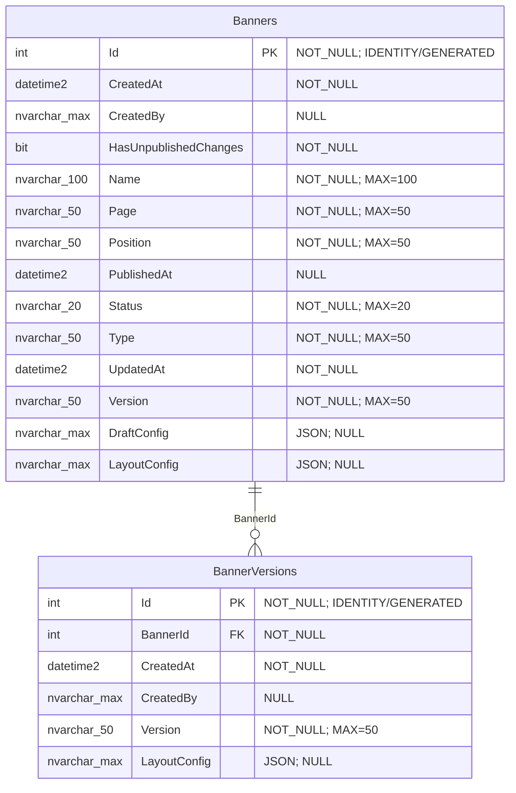

### Mục đích

Sơ đồ này mô tả dữ liệu quản lý banner hiển thị trên website. Mục đích là cho phép admin tạo nội dung quảng bá, chỉnh sửa bản nháp, xuất bản banner và khôi phục phiên bản cũ khi cần.

### Chức năng của mô đun

- Quản lý banner theo tên, loại, trang hiển thị, vị trí và trạng thái.
- Lưu cấu hình layout, responsive và redirect của banner bằng JSON.
- Hỗ trợ bản nháp để admin chỉnh sửa trước khi xuất bản.
- Lưu lịch sử phiên bản sau mỗi lần xuất bản.
- Cho phép rollback về phiên bản banner trước đó.

### Quan hệ dữ liệu trong sơ đồ

- Banners liên kết BannerVersions theo BannerId, một banner có nhiều phiên bản.
- LayoutConfig và DraftConfig là dữ liệu JSON thuộc Banners/BannerVersions, không tách thành bảng riêng.

### Giải thích nghiệp vụ

Banner thường thay đổi theo chiến dịch, vì vậy hệ thống cần phân biệt bản nháp và bản đã xuất bản. BannerVersions giúp giữ lại lịch sử, tránh mất nội dung cũ và cho phép khôi phục khi banner mới bị sai hoặc chiến dịch cần quay lại phiên bản trước.

## ERD-15. Ví, giao dịch số dư, rút tiền và bảo mật vận hành

### Script Mermaid

```mermaid
erDiagram
    AspNetUsers {
        nvarchar_450 Id PK "NOT_NULL"
        int RoleTemplateId FK "NULL"
        int AccessFailedCount "NOT_NULL"
        nvarchar_500 Avatar "NULL; MAX=500"
        decimal_18_2 CoinsBalance "NOT_NULL; CONCURRENCY"
        nvarchar_256 CoinsSignature "NULL; MAX=256"
        nvarchar_max ConcurrencyStamp "NULL; CONCURRENCY"
        datetime2 DateOfBirth "NULL"
        nvarchar_256 Email "NULL; MAX=256"
        bit EmailConfirmed "NOT_NULL"
        nvarchar_100 FullName "NOT_NULL; MAX=100"
        bit IsOnboarded "NOT_NULL"
        bit IsWishlistPublic "NOT_NULL"
        bit LockoutEnabled "NOT_NULL"
        datetimeoffset LockoutEnd "NULL"
        nvarchar_256 NormalizedEmail "NULL; MAX=256"
        nvarchar_256 NormalizedUserName "NULL; MAX=256"
        nvarchar_max PasswordHash "NULL"
        int PaymentPinFailedCount "NOT_NULL"
        nvarchar_256 PaymentPinHash "NULL; MAX=256"
        datetimeoffset PaymentPinLockoutEnd "NULL"
        nvarchar_13 PhoneNumber "NULL; MAX=13"
        bit PhoneNumberConfirmed "NOT_NULL"
        bit ReceiveEmailNotifications "NOT_NULL; IDENTITY/GENERATED"
        bit ReceiveOrderUpdates "NOT_NULL; IDENTITY/GENERATED"
        bit ReceivePromotions "NOT_NULL; IDENTITY/GENERATED"
        nvarchar_20 ReferralCode "NULL; MAX=20"
        nvarchar_max RefreshToken "NULL"
        datetime2 RefreshTokenExpiryTime "NULL"
        datetime2 RegisterDate "NOT_NULL"
        nvarchar_max SecurityStamp "NULL"
        bit Status "NOT_NULL"
        bit TwoFactorEnabled "NOT_NULL"
        nvarchar_256 UserName "NULL; MAX=256"
        decimal_18_2 WalletBalance "NOT_NULL; CONCURRENCY"
        nvarchar_256 WalletSignature "NULL; MAX=256"
        nvarchar_max WishlistShareToken "NULL"
    }
    Invoices {
        int InvoiceID PK "NOT_NULL; IDENTITY/GENERATED"
        int ShippingVoucherID FK "NULL"
        nvarchar_450 UserID FK "NULL"
        int VoucherID FK "NULL"
        decimal_18_2 AmountToPay "NOT_NULL"
        datetime2 CancelledAt "NULL"
        nvarchar_500 CancelReason "NULL; MAX=500"
        int CancelRefundMethod "NULL"
        decimal_18_2 CoinsDiscountAmount "NOT_NULL"
        datetime2 CompletedAt "NULL"
        datetime2 ConfirmedAt "NULL"
        datetime2 CreatedAt "NULL"
        decimal_18_2 DiscountAmount "NOT_NULL"
        nvarchar_50 InvoiceCode "NULL; MAX=50"
        bit IsDeleted "NOT_NULL"
        bit IsRefunded "NOT_NULL"
        bit IsReturnReceived "NOT_NULL"
        nvarchar_500 Note "NULL; MAX=500"
        int PayMethod "NULL"
        decimal_18_2 PointsDiscountAmount "NOT_NULL"
        nvarchar_max PrintTicketUrl "NULL"
        datetime2 RefundedAt "NULL"
        int RefundMethod "NULL"
        nvarchar_1000 ReturnDescription "NULL; MAX=1000"
        nvarchar_max ReturnImageUrls "NULL"
        nvarchar_max ReturnReason "NULL"
        datetime2 ShippedAt "NULL"
        nvarchar_500 ShippingAddress "NULL; MAX=500"
        decimal_18_2 ShippingDiscountAmount "NOT_NULL"
        nvarchar_100 ShippingDistrict "NULL; MAX=100"
        decimal_18_2 ShippingFee "NOT_NULL"
        nvarchar_15 ShippingPhone "NULL; MAX=15"
        nvarchar_100 ShippingProvince "NULL; MAX=100"
        nvarchar_100 ShippingRecipientName "NULL; MAX=100"
        nvarchar_500 ShippingStreetAddress "NULL; MAX=500"
        nvarchar_100 ShippingWard "NULL; MAX=100"
        int Status "NOT_NULL"
        decimal_18_2 SubTotal "NOT_NULL"
        decimal_18_2 TierDiscountAmount "NOT_NULL"
        decimal_18_2 TotalPrice "NOT_NULL"
        nvarchar_50 TrackingCode "NULL; MAX=50"
        decimal_18_2 VoucherDiscountAmount "NOT_NULL"
        decimal_18_2 WalletDiscountAmount "NOT_NULL"
    }
    PaymentTransactions {
        int PaymentTransactionId PK "NOT_NULL; IDENTITY/GENERATED"
        int InvoiceID FK "NOT_NULL"
        decimal_18_2 Amount "NOT_NULL"
        datetime2 CompletedAt "NULL"
        datetime2 CreatedAt "NOT_NULL"
        datetime2 FailedAt "NULL"
        nvarchar_500 FailureReason "NULL; MAX=500"
        datetime2 PaidAt "NULL"
        nvarchar_50 Provider "NOT_NULL; MAX=50"
        nvarchar_2000 RawQuery "NULL; MAX=2000"
        nvarchar_10 ResponseCode "NULL; MAX=10"
        int Status "NOT_NULL"
        nvarchar_50 TxnRef "NOT_NULL; MAX=50"
        nvarchar_50 VnPayTransactionNo "NULL; MAX=50"
    }
    BalanceTransactions {
        int Id PK "NOT_NULL; IDENTITY/GENERATED"
        int InvoiceID FK "NULL"
        nvarchar_450 UserID FK "NOT_NULL"
        decimal_18_2 Amount "NOT_NULL"
        datetime2 CreatedAt "NOT_NULL"
        int Direction "NOT_NULL"
        nvarchar_256 HashSignature "NOT_NULL; MAX=256"
        nvarchar_200 IdempotencyKey "NOT_NULL; MAX=200"
        nvarchar_255 Reason "NOT_NULL; MAX=255"
        int SourceType "NOT_NULL"
    }
    WithdrawRequests {
        int RequestID PK "NOT_NULL; IDENTITY/GENERATED"
        nvarchar_450 UserID FK "NOT_NULL"
        nvarchar_500 AdminNote "NULL; MAX=500"
        decimal_18_2 Amount "NOT_NULL"
        nvarchar_50 BankAccount "NOT_NULL; MAX=50"
        nvarchar_100 BankName "NOT_NULL; MAX=100"
        nvarchar_100 BankOwnerName "NOT_NULL; MAX=100"
        datetime2 CreatedAt "NOT_NULL"
        datetime2 ProcessedAt "NULL"
        nvarchar_50 Status "NOT_NULL; MAX=50"
    }
    Mongo_BlockedIps {
        string Id PK "ObjectId; mã bản ghi"
        string IpAddress "Địa chỉ IP"
        string Reason "Lý do chặn"
        datetime BlockedAt "Thời điểm chặn"
        datetime ExpiresAt "Thời điểm hết hạn"
        bool IsActive "Trạng thái chặn"
    }
    Mongo_SecurityAuditLogs {
        string Id PK "ObjectId; mã nhật ký bảo mật"
        string UserId "Người dùng liên quan"
        string IpAddress "IP phát sinh"
        string Action "Hành động/rủi ro"
        string RiskLevel "Mức rủi ro"
        datetime CreatedAt "Thời điểm ghi nhận"
    }
    Mongo_AuditLogs {
        string Id PK "ObjectId; mã nhật ký"
        string Action "Hành động"
        string UserId "Người thao tác"
        string EntityName "Đối tượng bị tác động"
        string EntityId "Mã bản ghi"
        string OldValues "Dữ liệu cũ"
        string NewValues "Dữ liệu mới"
        datetime Timestamp "Thời điểm ghi nhận"
    }
    AspNetUsers ||--o{ BalanceTransactions : "UserID"
    Invoices o|--o{ BalanceTransactions : "InvoiceID"
    AspNetUsers o|--o{ Invoices : "UserID"
    Invoices ||--o{ PaymentTransactions : "InvoiceID"
    AspNetUsers ||--o{ WithdrawRequests : "UserID"
```

### Mục đích

Sơ đồ này mô tả các dữ liệu tài chính phụ trợ và bảo mật vận hành. Mục đích là theo dõi số dư ví/xu, giao dịch thanh toán, yêu cầu rút tiền, đồng thời ghi nhận các rủi ro bảo mật và thao tác quản trị để phục vụ đối soát.

### Chức năng của mô đun

- Ghi nhận giao dịch thanh toán liên quan đến đơn hàng.
- Ghi mọi biến động ví, xu hoặc số dư của người dùng.
- Quản lý yêu cầu rút tiền và trạng thái xử lý của admin.
- Ghi nhật ký thao tác nghiệp vụ để kiểm tra thay đổi dữ liệu.
- Theo dõi IP bị chặn và sự kiện bảo mật trong quá trình vận hành.

### Quan hệ dữ liệu trong sơ đồ

- AspNetUsers liên kết BalanceTransactions và WithdrawRequests theo UserID.
- Invoices liên kết PaymentTransactions để đối soát thanh toán theo đơn.
- BalanceTransactions có thể liên kết Invoices khi biến động số dư phát sinh từ đơn hàng.
- Mongo_BlockedIps, Mongo_SecurityAuditLogs và Mongo_AuditLogs lưu dữ liệu phi quan hệ, liên kết logic qua UserId/IP/EntityId.

### Giải thích nghiệp vụ

Các thao tác tài chính cần khả năng truy vết cao. Vì vậy PaymentTransactions ghi giao dịch thanh toán, BalanceTransactions ghi biến động số dư, còn WithdrawRequests ghi yêu cầu rút tiền. Song song đó, MongoDB lưu log bảo mật và audit để admin kiểm tra các hành vi bất thường hoặc thao tác thay đổi dữ liệu.

## ERD-16. MongoDB cho AI, chatbot và nhật ký phi quan hệ

### Script Mermaid

```mermaid
erDiagram
    Mongo_UserInteractions {
        string Id PK "ObjectId; mã định danh tương tác"
        string UserId "Liên kết logic tới AspNetUsers.Id"
        int ProductId "Liên kết logic tới Products.ProductID"
        string InteractionType "View/Wishlist/Cart/Review/Purchase"
        float Score "Trọng số hành vi"
        datetime CreatedAt "Thời điểm phát sinh"
    }
    Mongo_KnowledgeArticles {
        string Id PK "ObjectId; mã bài tri thức"
        string Title "Tiêu đề"
        string Content "Nội dung tri thức"
        string Category "Nhóm nội dung"
        datetime CreatedAt "Ngày tạo"
        datetime UpdatedAt "Ngày cập nhật"
    }
    Mongo_AuditLogs {
        string Id PK "ObjectId; mã nhật ký"
        string Action "Hành động"
        string UserId "Người thao tác"
        string EntityName "Đối tượng bị tác động"
        string EntityId "Mã bản ghi"
        string OldValues "Dữ liệu cũ"
        string NewValues "Dữ liệu mới"
        datetime Timestamp "Thời điểm ghi nhận"
    }
    Mongo_BlockedIps {
        string Id PK "ObjectId; mã bản ghi"
        string IpAddress "Địa chỉ IP"
        string Reason "Lý do chặn"
        datetime BlockedAt "Thời điểm chặn"
        datetime ExpiresAt "Thời điểm hết hạn"
        bool IsActive "Trạng thái chặn"
    }
    Mongo_SecurityAuditLogs {
        string Id PK "ObjectId; mã nhật ký bảo mật"
        string UserId "Người dùng liên quan"
        string IpAddress "IP phát sinh"
        string Action "Hành động/rủi ro"
        string RiskLevel "Mức rủi ro"
        datetime CreatedAt "Thời điểm ghi nhận"
    }
```

### Mục đích

Sơ đồ này mô tả nhóm collection MongoDB dùng cho dữ liệu linh hoạt, ghi log, AI và chatbot. Các collection này không có khóa ngoại vật lý như SQL Server, nhưng hỗ trợ những nghiệp vụ cần ghi nhanh, dữ liệu thay đổi linh hoạt hoặc không phù hợp lưu trong bảng quan hệ.

### Chức năng của mô đun

- Lưu hành vi người dùng với sản phẩm để phục vụ recommendation và huấn luyện mô hình.
- Lưu bài tri thức hoặc dữ liệu nền cho chatbot hỗ trợ khách hàng.
- Ghi nhật ký thao tác nghiệp vụ dưới dạng linh hoạt.
- Lưu danh sách IP bị chặn phục vụ chống spam hoặc chặn tạm thời.
- Ghi nhật ký bảo mật, cảnh báo rủi ro và sự kiện bất thường.

### Quan hệ dữ liệu trong sơ đồ

- MongoDB không enforce FK vật lý giữa các collection.
- UserId trong Mongo_UserInteractions, Mongo_AuditLogs hoặc Mongo_SecurityAuditLogs là liên kết logic đến AspNetUsers.Id.
- ProductId trong Mongo_UserInteractions là liên kết logic đến Products.ProductID.
- EntityId trong Mongo_AuditLogs là mã bản ghi nghiệp vụ bị tác động, có thể thuộc nhiều bảng khác nhau.

### Giải thích nghiệp vụ

MongoDB được dùng như lớp lưu trữ bổ sung cho dữ liệu phi quan hệ. Ví dụ hành vi người dùng và audit log có thể phát sinh rất nhiều, cấu trúc thay đổi theo loại hành động và cần ghi nhanh. Vì vậy hệ thống không ép chúng vào quan hệ FK cứng, mà dùng các mã như UserId, ProductId hoặc EntityId để truy vết logic khi cần.

