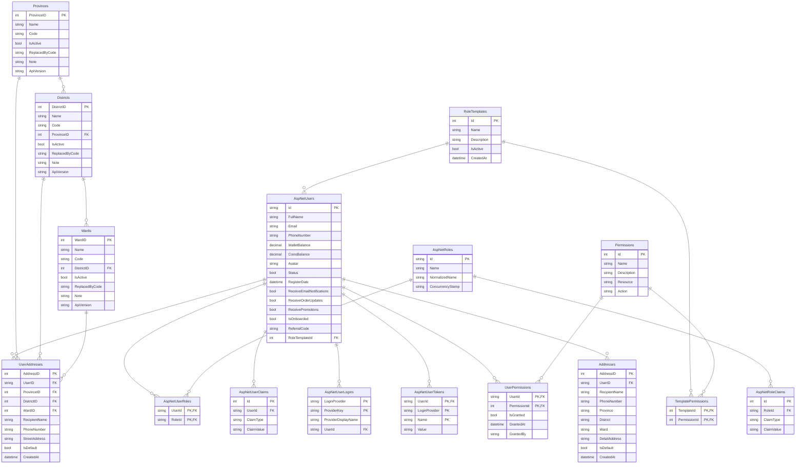
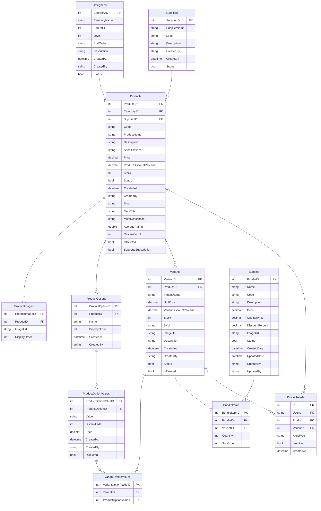
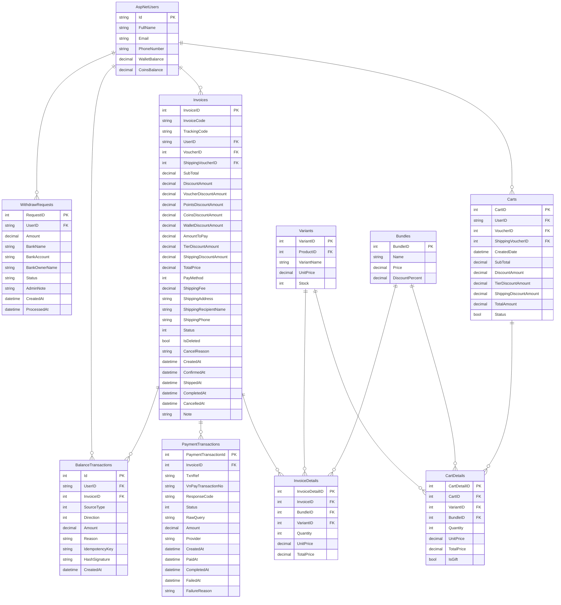
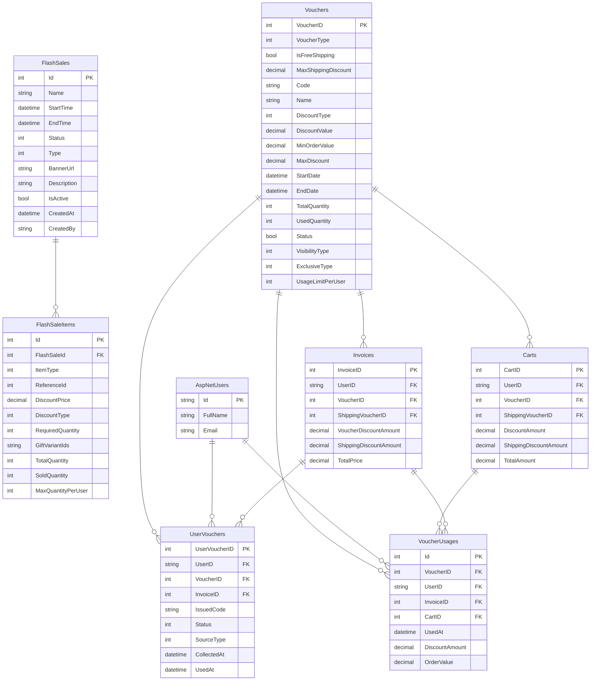
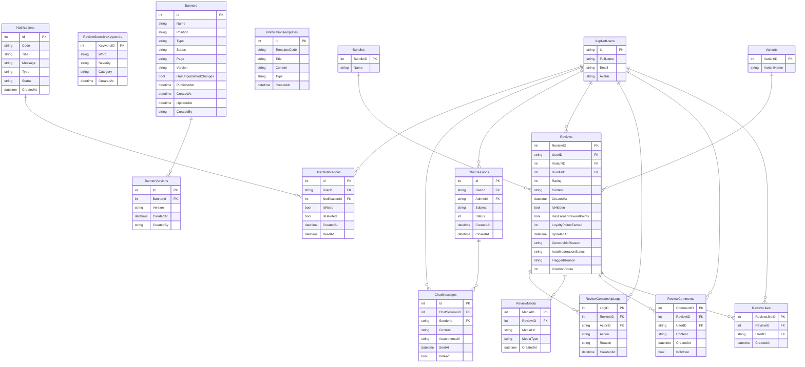
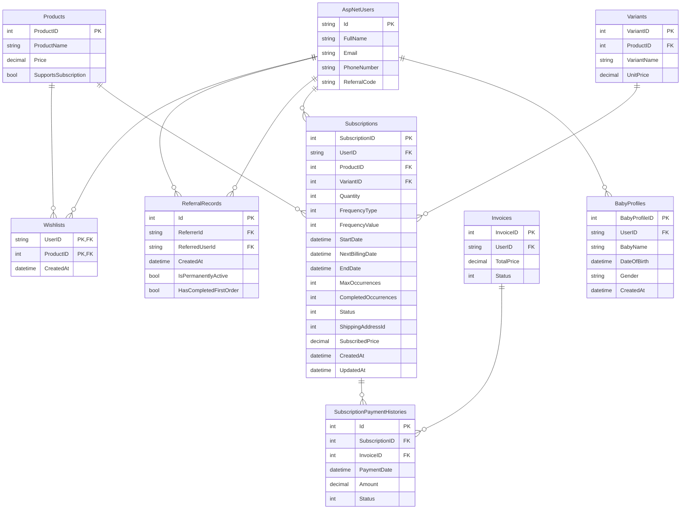

# ERD Theo Mo Dun - Mermaid

File nay gom cac so do ERD theo tung mo dun cua du an LazPe. Moi so do co thuoc tinh bang va quan he chinh, de khi dan vao Mermaid Live khong bi roi nhu ERD tong.

## 1. Mo Dun Tai Khoan, Phan Quyen Va Dia Chi

## 2. Mo Dun San Pham, Bien The Va Combo

## 3. Mo Dun Gio Hang, Don Hang Va Thanh Toan

## 4. Mo Dun Khuyen Mai, Voucher Va Flash Sale

## 5. Mo Dun Khach Hang Than Thiet

```mermaid
erDiagram
    AspNetUsers {
        string Id PK
        string FullName
        string Email
        decimal CoinsBalance
        decimal WalletBalance
    }

    LoyaltyProfiles {
        string UserID PK, FK
        int CurrentTierID FK
        int AvailablePoints
        int TotalPoints
        int PointsToNextTier
        int RankAdjustmentOffset
        int CurrentCheckInStreak
        datetime LastCheckInDate
        datetime LastUpdated
    }

    LoyaltyTiers {
        int TierID PK
        string TierName
        int MinPoints
        string ColorHex
        string BadgeIcon
        bool IsActive
        datetime CreatedAt
        datetime UpdatedAt
    }

    LoyaltyPointHistories {
        long HistoryID PK
        string UserID FK
        string TransactionType
        int Amount
        int InvoiceID FK
        string Description
        datetime CreatedAt
    }

    LoyaltyEarnPolicies {
        int PolicyID PK
        string Name
        decimal VndAmount
        int PointsEarned
        datetime StartDate
        datetime EndDate
        bool IsActive
        bool IsCampaign
        decimal Multiplier
        string CreatedBy
        datetime CreatedAt
    }

    LoyaltyRedeemPolicies {
        int PolicyID PK
        string Name
        int PointsToRedeem
        decimal DiscountVnd
        int TierID FK
        datetime StartDate
        datetime EndDate
        bool IsActive
        string CreatedBy
        datetime CreatedAt
    }

    LoyaltyTierPrivileges {
        int PrivilegeID PK
        int TierID FK
        string Name
        string PrivilegeType
        string Value
        bool IsActive
        string CreatedBy
        datetime CreatedAt
    }

    LoyaltyMonthlyVouchers {
        int VoucherConfigID PK
        int TierID FK
        int VoucherCount
        int DiscountType
        decimal DiscountValue
        decimal MinOrderValue
        decimal MaxDiscount
        int ValidityDays
        bool IsActive
        datetime CreatedAt
    }

    LoyaltyVoucherRedemptions {
        int Id PK
        int VoucherID FK
        int PointCost
        int TierID FK
        int LimitPerUserPerPeriod
        int TotalQuotaPerPeriod
        int ResetCycle
        int ResetDayOfMonth
        datetime StartDate
        datetime EndDate
        bool IsActive
        datetime CreatedAt
        datetime UpdatedAt
    }

    LoyaltyVoucherRedemptionHistories {
        int Id PK
        string UserID FK
        int VoucherID FK
        int UserVoucherID FK
        int PointCost
        string PeriodKey
        datetime RedeemedAt
    }

    LoyaltyManualRevocations {
        int RevocationID PK
        string UserID FK
        int Amount
        string Reason
        string AuditorID
        datetime CreatedAt
    }

    LoyaltyBirthdayGiftLogs {
        int GiftLogID PK
        string UserID FK
        int Year
        string GiftType
        string GiftValue
        string IssuedBy
        datetime ReceivedAt
    }

    LoyaltySettings {
        int Id PK
        bool EnableReviewReward
        int ReviewRewardPoints
        int MinimumReviewWords
        int RequiredRatingForReward
        bool AllowMultipleRewardsPerProduct
        int WelcomeVoucherID FK
        int ReviewWithImageRewardPoints
        int ReviewWithVideoRewardPoints
        int MinimumReviewChars
        int AllowEditReviewTimeLimitMinutes
        int MaxReviewDaysAfterReceipt
        bool RequireDeliveryToReview
        datetime UpdatedAt
    }

    Vouchers {
        int VoucherID PK
        string Code
        string Name
        int DiscountType
        decimal DiscountValue
    }

    UserVouchers {
        int UserVoucherID PK
        string UserID FK
        int VoucherID FK
        int Status
        int SourceType
    }

    Invoices {
        int InvoiceID PK
        string UserID FK
        decimal PointsDiscountAmount
        decimal TotalPrice
    }

    AspNetUsers ||--|| LoyaltyProfiles : ""
    LoyaltyTiers ||--o{ LoyaltyProfiles : ""
    LoyaltyProfiles ||--o{ LoyaltyPointHistories : ""
    Invoices ||--o{ LoyaltyPointHistories : ""
    LoyaltyTiers ||--o{ LoyaltyRedeemPolicies : ""
    LoyaltyTiers ||--o{ LoyaltyTierPrivileges : ""
    LoyaltyTiers ||--o{ LoyaltyMonthlyVouchers : ""
    Vouchers ||--o{ LoyaltyVoucherRedemptions : ""
    LoyaltyTiers ||--o{ LoyaltyVoucherRedemptions : ""
    AspNetUsers ||--o{ LoyaltyVoucherRedemptionHistories : ""
    Vouchers ||--o{ LoyaltyVoucherRedemptionHistories : ""
    UserVouchers ||--o{ LoyaltyVoucherRedemptionHistories : ""
    AspNetUsers ||--o{ LoyaltyManualRevocations : ""
    AspNetUsers ||--o{ LoyaltyBirthdayGiftLogs : ""
    Vouchers ||--o{ LoyaltySettings : ""
```

## 6. Mo Dun Danh Gia, Chat, Thong Bao Va Noi Dung

## 7. Mo Dun Wishlist, Gioi Thieu, Dang Ky Dinh Ky Va Ho So Em Be

